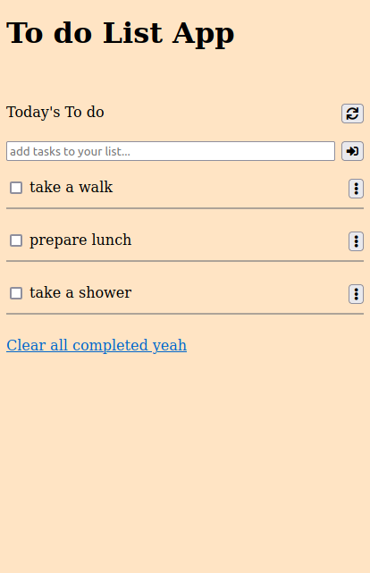

# Todo List app

Additional description about the project and its features.

## Built With

- HTML5
- CSS3
- Webpack
- JavaScript

## Getting Started

To get a local copy up and running follow these simple steps.

- Clone using SSH git@github.com:badrbenslama/to_do_app.git
- Clone using https https://github.com/badrbenslama/to_do_app.git

## Authors

👤 **badrbenslama**

- GitHub: [@badrbenslama](https://github.com/badrbenslama)

## 🤝 Contributing

Contributions, issues, and feature requests are welcome!

Feel free to check the [issues page](../../issues/).

## Show your support

Give a ⭐️ if you like this project!

## Acknowledgments

- Hat tip to anyone whose code was used
- Inspiration
- etc

## 📝 License

This project is [MIT](./MIT.md) licensed.
